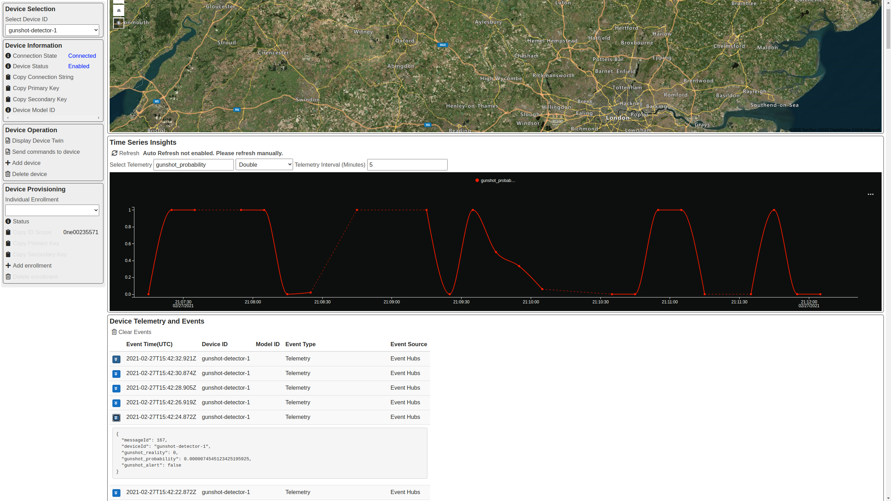

## Introduction

This project is a group excercise undertaken as part of the University of Oxford - Artificial Intelligence: Cloud and Edge Implementations course as a learnig challenge from Microsoft and Elephant Listening Project. The objective is to devise solutions for gunshot detection in tropical african forests and to create instant alerts to curtail poaching attempts. 

## Challenge

The current model is very inefficient - less than .2% of tagged signals are gunshots and we typically get 10K- 15K tagged signals in a four-month deployment at just one of the 50 recording sites. The issue is we have about 200 good gunshots annotated, but because poaching is way too high, gunshots are still extremely rare in the sounds and it is extremely time-consuming to create the "truth" logs where we can say that every gunshot in a 24hr file has been tagged. From our understanding, this makes developing a detector more difficult.

## Data Collection, Analysis and Feature extraction

So the main issue in this domain is the lack of tagged data and also the gunshot audio for such use cases are proprietary. So we collected random gunshot samples and other enviromental audio samples from internet sources. A few of them are available in the [Sample audio](../Code/Sample_Audio_Data) folder. There was some basic audio cleaning done to remove noise and clip exact audio data points post converting all formats to `.wav` files into the dataset. Further audio analysis was carried out as per [Analysis Notebooks](../Code/Analysis) folder.

Many features were analyzed across two different classes namely gunshot and environmental audio. The environmental audio contains audio data of elephant noises and other sounds of the tropical african forests. The features analyzed are as follows,

- Spectral Centroid
- 13 MFCCs
- Zero Crossing Rate
- Onset Detection Frequency

There could be more features relevant to this classification problem which can be analyzed to imporve the model in the future and for the scope of this excercise the first thirteen Mel-Frequency Cepstral Coefficients suited best as input features for audio classification.

## Model Training

Now we have to converted the gunshot detection issue into a machine learning problem. The input to the ML model will be a set of audio features and the ML model has to classify it into two classes, i.e gunshot or environmental audio. Since this is a binary classification problem a suitable [Dataset](../Code/Dataset) was created for training purposes. A [feature extraction script](../Code/Model_Training/feature_extraction.py) was created to convert the raw audio into relevant feature data and corresponding true values for classification.

Two model architectures tested by running scripts from the [Makefle](../Code/Model_Training/Makefile) and the following results were observed,

| Neural Network Architecture                | Train Accuracy | Test Accuracy |
| ---------------------------- | -------------- | ------------- |
| Multi-layer Perceptron       | 0.9750         | 0.9205        |
| Convolutional Neural Network | 0.9756         | 0.9436        |

Note: Obviously these metrics depend directly on the data trained on and further improvements in data, features and model architecture is needed for this to be of any practical application.

## Deployment

The models can be deployed using [NVIDIA Triton Inference Server](https://developer.nvidia.com/nvidia-triton-inference-server) and a [notebook](../Code/Deployment/deploy.ipynb)demonstates the best approach to a cloud native inference setup.

### Project 15 Setup

- Deploy the Project 15 platform as per instructions here https://microsoft.github.io/project15/Deploy/Deployment.html

- Add a device called `gunshot-detector-1` as per the instructiones here https://microsoft.github.io/project15/Deploy/ConnectingDevice.html


### Threat Simulation and Client

* We have created a NodeJs based client that sends predictions to IoT Hub using tensorflow as backend. [Link to client](../Code/Deployment/Client)

* Convert the models to tfjs graph format for the client to predict
```
make convert_model
```

* Copy IoT device connection string to `.env` file in the [client folder](../Code/Deployment/Client) as follows

```
CONN_STR=<conn-string>
DETECTOR_ID=gunshot-detector-1
```

* Run the client simulation to send telemetry data to IoT Hub
```
make run_client_simulation
```

### Live Monitoring

- Monitor gunshot detection from the Project 15 app
  


## Relevant Links

- https://elephantlisteningproject.org/
- https://microsoft.github.io/project15/

## Research Links

- https://www.paperswithcode.com/datasets?q=gunshot&v=lst&o=match
- https://developers.google.com/machine-learning/guides/text-classification/step-4

## Team

### University of Oxford - Artificial Intelligence: Cloud and Edge Implementations - Team 3

- Sachin Varghese
- Prasad Deshpande
- Loc Nguyen
- Eden Bodkin
- Kennedy. Mumba
- Ashwin Mylavarapu
- Menelaos Malaxianakis